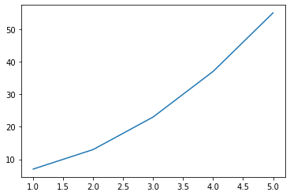

```python
import numpy as np
import matplotlib.pyplot as plt
```


```python
x = np.array([1,2,3,4,5])
y = np.array(2*x**2 + 5)
```


```python
plt.plot(x,y)
```


    [<matplotlib.lines.Line2D at 0x7f903cd830d0>]


    

    

